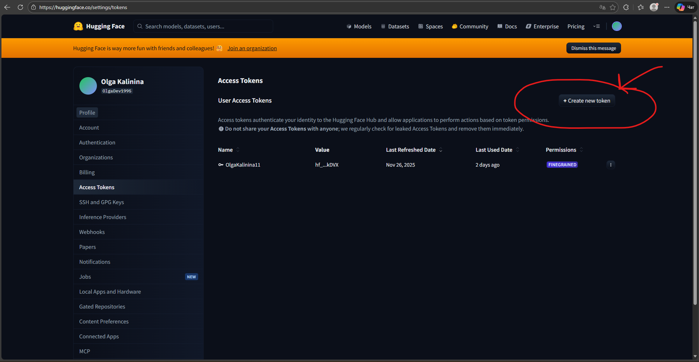

# Как получить API-ключи для web demo и Android-приложения

Для работы проекта вам понадобятся **несколько API-ключей** от разных сервисов.
Не пугайтесь: каждый из них берётся по одной и той же схеме — «зарегистрировался → нашёл раздел API → создал ключ → аккуратно сохранил».

### ❗ Если вы пользуетесь VPN по ряду жизненных обстоятельств, то убедитесь, что он включен перед заходом на любой из сайтов.  

---

## 1. Ключи для web demo

Эти ключи нужны, чтобы работала **веб-демка** (диалоги с вашим ИИ в браузере).

### 1.1. Провайдеры LLM (текстовые модели)

Вам понадобятся переменные окружения:

```env
OPENAI_API_KEY=sk-...
XAI_API_KEY=xai-...
DEEPSEEK_API_KEY=sk-...
```

#### Как получить `OPENAI_API_KEY`

1. Перейдите на сайт: [https://platform.openai.com/docs/overview](https://platform.openai.com/docs/overview)
2. Зарегистрируйте аккаунт (если его ещё нет).
3. Найдите раздел **API keys** или кнопку **Create API key**.
4. Нажмите **Create API key**.
5. Скопируйте ключ и сохраните его в надёжном месте (блокнот, парольный менеджер).
6. Пополните баланс хотя бы на **$2**, чтобы запросы точно работали (если не знаете как, погуглите про виртуальные карты).  

#### Как получить `XAI_API_KEY`

1. Перейдите на сайт: [https://console.x.ai/](https://console.x.ai/)
2. Зарегистрируйте аккаунт.
3. Найдите раздел **API Keys**.
4. Нажмите **Create API key**.
5. Скопируйте ключ, сохраните.
6. Пополните баланс хотя бы на **$2** (если не знаете как, погуглите про виртуальные карты).

#### Как получить `DEEPSEEK_API_KEY`

1. Перейдите на сайт: [https://platform.deepseek.com/](https://platform.deepseek.com/)
2. Зарегистрируйте аккаунт.
3. Найдите раздел **API Keys**.
4. Нажмите **Create API key**.
5. Скопируйте ключ, сохраните.
6. Пополните баланс хотя бы на **$2**(если не знаете как, погуглите про виртуальные карты).  

---

### 1.2. Провайдер vision-LLM (для скриншотов и фото)

Для обработки скриншотов и фотографий нужен:

```env
HUGGING_FACE_API_KEY=hf_...
```

#### Как получить `HUGGING_FACE_API_KEY`

1. Перейдите на сайт: [https://huggingface.co/](https://huggingface.co/)
2. Зарегистрируйте аккаунт.
3. В правом верхнем углу перейдите в **Account** → **Access Tokens**.
   ⚠️ Важно: нужен именно раздел **Access Tokens**, а не «API key».
4. Нажмите **New token** / **Create access token**.
5. Выберите тип токена (обычно достаточно прав **read**) и создайте его.
6. Скопируйте полученный токен — он и есть `HUGGING_FACE_API_KEY`. На баланс ничего класть не нужно.



---

## 2. Дополнительные ключи для Android-приложения (tools)

Эти ключи **не обязательны для web demo**, но нужны, если вы хотите полноценно пользоваться **tools** в Android-приложении: погодой и пуш-напоминаниями.

Нужны ключи:

```env
OPENWEATHER_API_KEY=...
PUSHY_SECRET_KEY=...
```

### 2.1. Как получить `OPENWEATHER_API_KEY` (погода)

1. Перейдите на сайт: [https://openweathermap.org/api](https://openweathermap.org/api)
2. Зарегистрируйтесь.
3. В личном кабинете найдите раздел **API keys**.
4. Создайте новый ключ или используйте сгенерированный по умолчанию.
5. Скопируйте его и сохраните как `OPENWEATHER_API_KEY`.

> Для личного ИИ вы **никогда в жизни** не выберете их бесплатные **1000 запросов в день**.

### 2.2. Как получить `PUSHY_SECRET_KEY` (напоминания / push-уведомления)

1. Перейдите на сайт: [https://dashboard.pushy.me/](https://dashboard.pushy.me/)
2. Зарегистрируйтесь.
3. В панели управления найдите раздел с API / Secret key.
4. Скопируйте свой **Secret key** и сохраните как `PUSHY_SECRET_KEY`.

> Аналогично, для личного ИИ их бесплатного лимита вам более чем достаточно.

---

## 3. Если что-то пошло не так

Если вы:

* не нашли нужную кнопку,
* не обнаружили раздел с ключами,
* увидели страшную ошибку,
* запутались в шаге,

**не паникуйте**. Скопируйте:

1. Текст шага из этого гайда, на котором вы застряли.
2. Текст ошибки (или сделайте скриншот и перепишите, что там написано).
3. Коротко опишите, **что вы делали до этого момента** — а лучше заранее записывайте все ваши шаги по установке.

И напишите любому ИИ-ассистенту (ChatGPT, Claude, Grok, DeepSeek и т.п.) примерно так:

> *«Я впервые получаю API-ключ для [название сервиса] по этому гайду. Я застрял на шаге [номер шага]. Вот текст шага и вот ошибка. Вот что я уже сделал до этой ошибки. Помоги, пожалуйста, разобраться, что мне сделать дальше».*

Они отлично умеют объяснять такие вещи простым языком и подсказывать конкретные шаги.

---

## 4. Небольшое примечание для dev'ов

> Почему Pushy, а не Google Firebase?
> Потому что я так хочу, у Pushy простой и предсказуемый API, а Google со своим Firebase/мы вас закрыли резко и без предупреждений мне не друг.
> Хотите иначе — меняйте на что угодно: хоть на свой WebSocket, хоть на другого пуш-провайдера.
