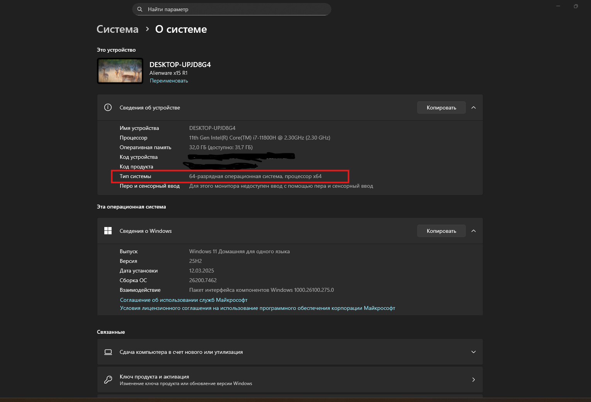

## Важно

Этот гайд написан **специально для пользователей Windows**.
Если у вас **Linux или macOS**:

1. Скопируйте **этот гайд целиком**.
2. Вставьте его в **ChatGPT, Claude, Grok, DeepSeek или любого другого ИИ-ассистента**.
3. Напишите что-то вроде:
   *«У меня есть вот такой гайд под Windows, но у меня Linux/macOS. Помоги, пожалуйста, сделать то же самое на моей операционной системе»*.

Он адаптирует шаги под вашу ОС.

---

# Как установить PyCharm и Python 3.11 на Windows

Этот гайд для тех, кто **никогда раньше ничего не устанавливал для программирования**. Делайте по шагам, не перескакивайте — и всё получится 🙃

---

## Шаг 1. Узнайте версию своей Windows

Нам нужно понять, какая у вас система: **x86** (32-bit) или **x64** (64-bit).

1. Нажмите кнопку **Пуск**.
2. Введите в поиск: `Система`.
3. Откройте найденное приложение/экран «Система».

На открывшемся экране найдите строку вида:

* `Windows x64` или
* `Windows x86`

Запомните, что там написано — это пригодится для выбора версии PyCharm.

---

## Шаг 2. Установите PyCharm

PyCharm — это программа, в которой вы будете писать код (IDE). Если вы пользуетесь VPN по ряду жизненных обстоятельств, то устанавливать его необходимо, включив на компьютере VPN, или выбрать VS Code (но он сложнее).

1. Перейдите на сайт:
   [https://www.jetbrains.com/pycharm/download/?section=windows](https://www.jetbrains.com/pycharm/download/?section=windows)
2. Выберите:
   * **Windows x64** или **Windows x86** — в зависимости от того, что вы нашли в Шаге 1.
3. Скачайте установочный файл и запустите его. Если при установке вылетела любого рода ошибка - **скачайте другой установочный файл**.
4. Следуйте инструкциям установщика (можно везде оставлять настройки по умолчанию, если не уверены).

Дополнительно: подробный гайд с картинками по установке PyCharm на Windows:
[https://shultais.education/blog/python-for-beginners/install-pycharm-windows](https://shultais.education/blog/python-for-beginners/install-pycharm-windows)

---

## Шаг 3. Установите Python 3.11

Теперь нужно установить сам язык Python.

1. Перейдите на сайт:
   https://www.python.org/downloads/windows/
2. Найдите и скачайте **Python 3.11** для Windows.  
3. Запустите установщик **от имени администратора** (правый клик по файлу → «Запуск от имени администратора»).
4. На первом экране **обязательно**:

   * Поставьте галочку **«Add Python to PATH»** (если есть).
5. Нажмите Install и дождитесь конца установки.

Подробный гайд по установке Python на Windows (с картинками):
[https://shultais.education/blog/python-for-beginners/install-python-windows](https://shultais.education/blog/python-for-beginners/install-python-windows)

---

## Шаг 4. Перезагрузите компьютер. Все изменения системных переменных (а именно это вы делали тыкая на «Add Python to PATH») применяются только после перезагрузки или полного перезапуска всех процессов.
---

## Шаг 5. Если что-то пошло не так

Если вы:

* не нашли нужную кнопку,
* увидели страшную ошибку,
* запутались в шаге,

**не паникуйте**. Скопируйте:

1. Текст шага из этого гайда, где вы застряли.
2. Текст ошибки или сделайте скриншот и перепишите, что там написано.
3. Постарайтесь описать текстом, что вы делали до этого - а лучше заранее записывайте все ваши шаги по установке. 

И напишите любому ИИ-ассистенту (ChatGPT, Claude, Grok, DeepSeek и т.п.) примерно так:

> *«Я впервые устанавливаю окружение для Python по этому гайду. Я застрял на шаге [номер шага]. Вот текст шага и вот ошибка. Вот что я уже сделал до этой ошибки. Помоги, пожалуйста, разобраться, что мне сделать дальше».*

Они отлично умеют объяснять такие вещи простым языком.

---

## Шаг 6. Если вы хотите другую среду разработки

В этом проекте по умолчанию используется **PyCharm**, но вы можете выбрать и другую IDE, например:

* **VS Code**
* **Visual Studio** (не путать с VS Code)
* Другие редакторы под Python

Если хотите поставить **VS Code**, просто загуглите:

> `установка VS Code для Python на Windows`

или спросите у ИИ-ассистента:

> *«Я хочу вместо PyCharm использовать VS Code. Помоги, пожалуйста, установить и настроить VS Code для Python на Windows».*

