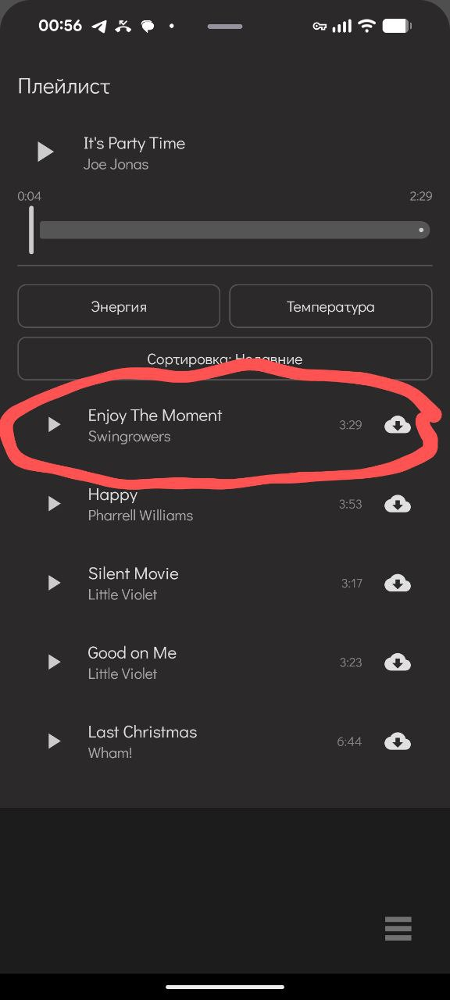
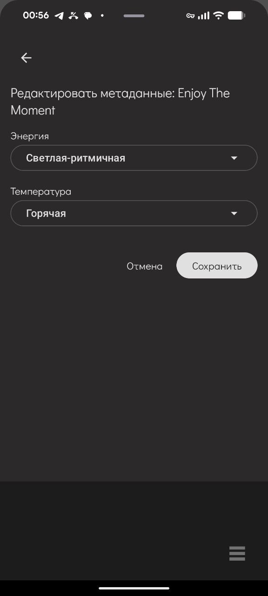

## Как заполнить БД для плейлиста

### 1. Подготовьте треки

1. Зайдите на **Free Music Archive** (~~а ни на какой не rutracker~~). Если у вас есть мой telegram - пишите, пришлю свою подборку.  
2. Скачайте столько треков, сколько вам нужно.
3. Сложите все файлы в одну папку на ноутбуке или сервере  
   (например: `C:\Users\Alien\Music\victor_playlist` или `/home/user/music/victor_playlist`).

---

### 2. Просканируйте папку скриптом

Перейдите в репозитории в утилиту для плейлиста:

```bash
tools/playlist/database_utils/scan_music.py
````

В файле на строке с `music_folder` укажите путь к вашей папке с треками, например:

```python
music_folder = r"C:\Users\Alien\Music\victor_playlist"
# или, для Linux/macOS:
# music_folder = "/home/user/music/victor_playlist"
```

Запустите скрипт:

```bash
python tools/playlist/database_utils/scan_music.py
```

Скрипт пройдётся по папке, прочитает метаданные треков и заполнит локальную БД плейлиста.

---

### 3. Разметьте треки в приложении

1. Откройте **шторку плейлиста** в приложении.
2. Зайдите в режим редактирования трека.
3. Для **каждого трека** проставьте:

   * **энергию**,
   * **температуру**.

Это важно: без этих параметров **Adaptive Wave** и агрегация для LLM работать не будут как задумано.

<div align="center">
  <table>
    <tr>
      <td align="center">
        <br/>
        <sub>Редактирование метаданных 1</sub>
      </td>
      <td align="center">
        <br/>
        <sub>Редактирование метаданных 2</sub>
      </td>
    </tr>
  </table>
</div>

Готово: после этого Victor сможет подбирать музыку под контекст и настроение. 🎧💙


